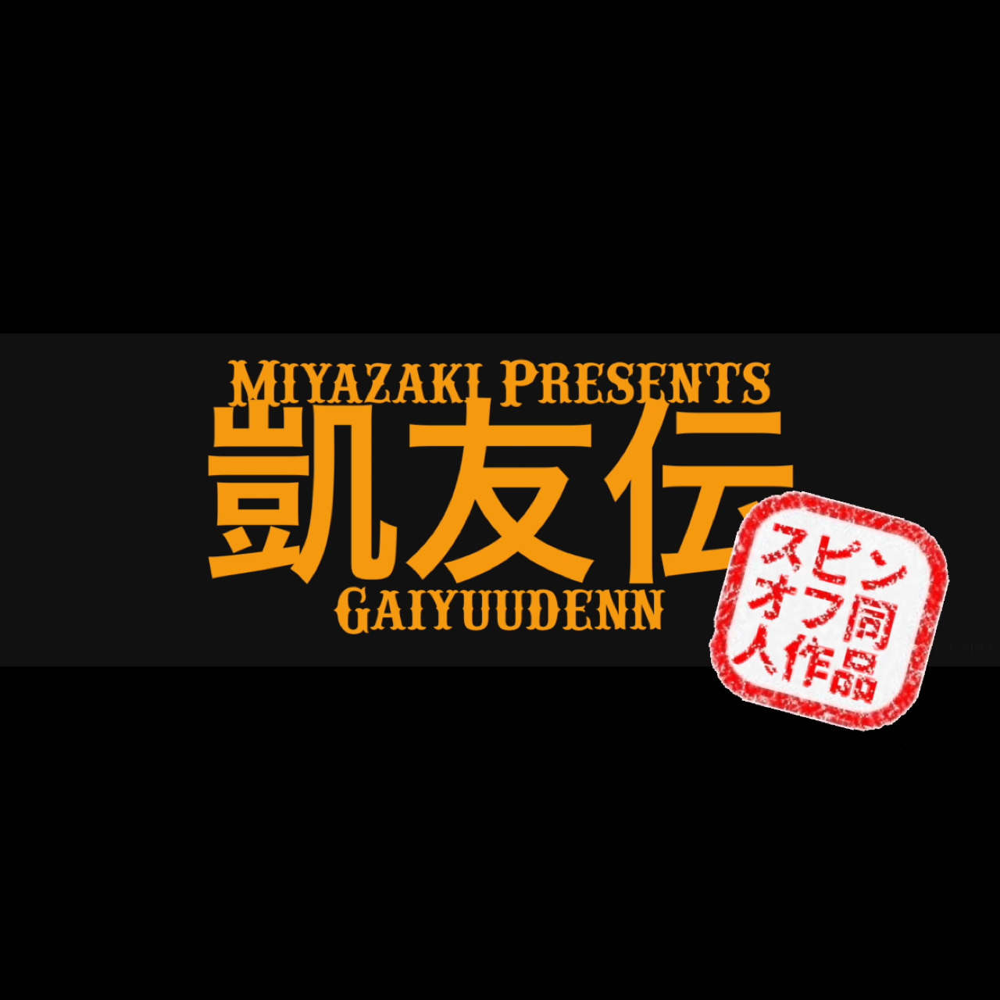

<!DOCTYPE html>
<html lang="ja">
<head>
  <meta charset="UTF-8">
  <title>NMIクリエイターず ホームページ</title>
  
  
</head>
<body>

  <h1>NMIクリエイターず ホームページ</h1>

  

  
  

    <h2>NMIクリエイターずとは？</h2>
    

      NMIクリエイターずは、動画制作・脚本・映像編集などを手がける高校生クリエイターチームです。 
      主な作品には「凱友伝」や「エストリア叙事詩」があり、視聴者にワクワクする世界観を届けることを目指しています。
    

  

  

    <h2>このサイトの使い方（説明動画）</h2>
    <iframe src="動画のURLをここに入れてください（GitHubにアップロードしたもの）" allowfullscreen></iframe>
  

  

    <h2>アーカイブ</h2>
    <button class="accordion" onclick="togglePanel(this)">アーカイブを表示</button>
    

      <!-- ▼ここからコピーして章を増やせます -->
      

      
      

        
凱友伝 旧2章

        

          GYD_2
          <button class="copy-btn" onclick="copyPassword('GYD_2')">コピー</button>
        

      

    

      

      
      

        
凱友伝 旧2.5章

        

          GYD_2.5
          <button class="copy-btn" onclick="copyPassword('GYD_2.5')">コピー</button>
        

      

    

    

      
      

        
凱友伝 新1章

        

          GYD_n_1
          <button class="copy-btn" onclick="copyPassword('GYD_n_1')">コピー</button>
        

      

    

    

      
      

        
凱友伝 カオストーナメント

        

          GYD_chaos
          <button class="copy-btn" onclick="copyPassword('GYD_chaos')">コピー</button>
        

      

    

    

      
      

        
凱友伝 旧3章

        

          GYD_3
          <button class="copy-btn" onclick="copyPassword('GYD_3')">コピー</button>
        

      

    

    

      
      

        
凱友伝 新2章

        

          GYD_n_2
          <button class="copy-btn" onclick="copyPassword('GYD_n_2')">コピー</button>
        

      

    

    

      
      

        
凱友伝 新3章

        

          GYD_n_3
          <button class="copy-btn" onclick="copyPassword('GYD_n_3')">コピー</button>
        

      

    

    

      
      

        
凱友伝 高校生最強ランキング

        

          GYD_ranking
          <button class="copy-btn" onclick="copyPassword('GYD_ranking')">コピー</button>
        

      

    

    

      
      

        
未定

        

          ここにパスワード
          <button class="copy-btn" onclick="copyPassword('ここにパスワード')">コピー</button>
        

      

    </div＞
      <!-- ▲ここまで -->
    

  

  

    <h2>世界観と各章の紹介</h2>
    <button class="accordion" onclick="togglePanel(this)">章紹介を表示</button>
    

      <!-- ▼ここからコピーして紹介ページを増やせます -->
      <a class="link-button" href="凱友伝紹介ページへのリンク">凱友伝 紹介ページ</a> 
      <a class="link-button" href="凱友伝紹介ページへのリンク">エストリア叙事詩 紹介ページ</a> 
      <!-- ▲ここまで -->
    

  

  

    <h2>キャラクター紹介</h2>
    <a class="link-button" href="キャラクター紹介ページへのリンク">キャラクター紹介ページへ</a>
  

  

    <h2>用語紹介</h2>
    <a class="link-button" href="用語紹介ページへのリンク">用語紹介ページへ</a>
  

</body>
</html>
